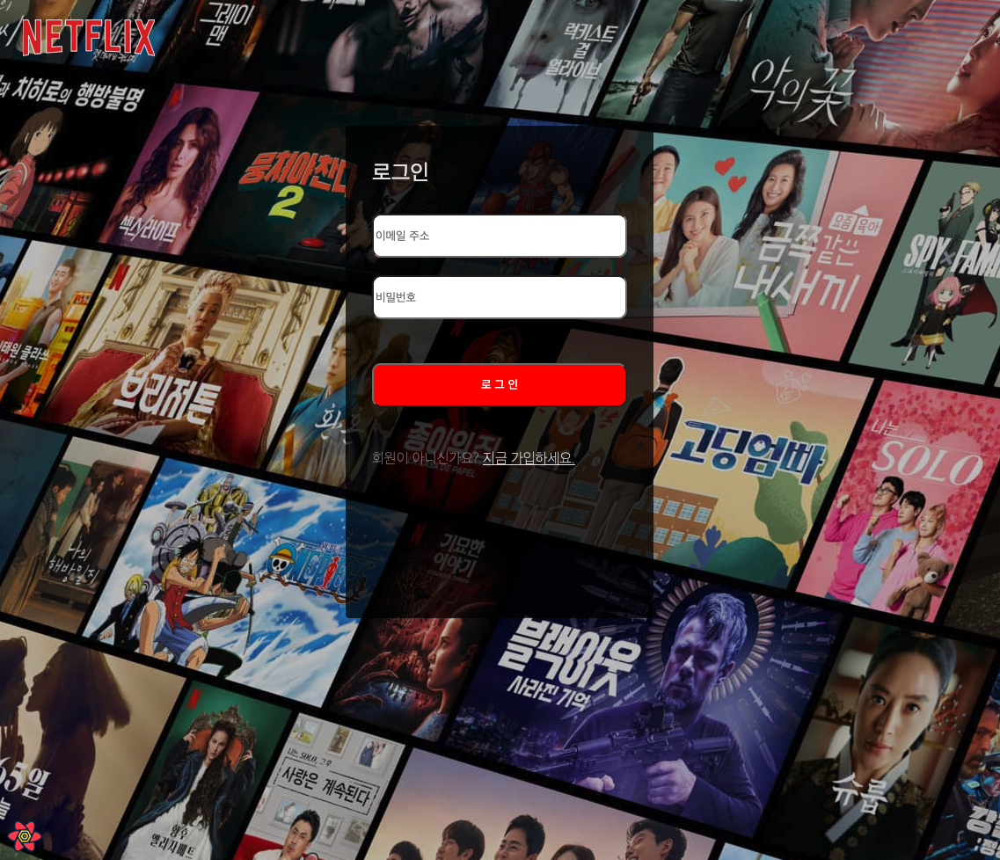
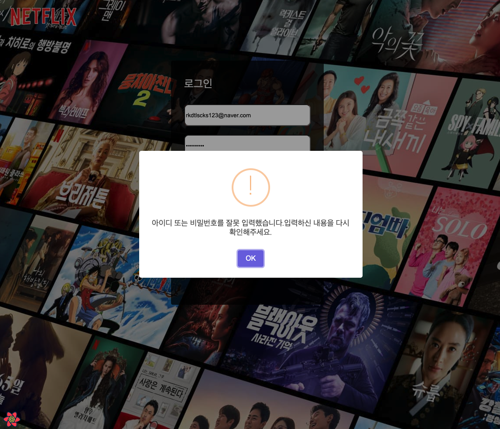
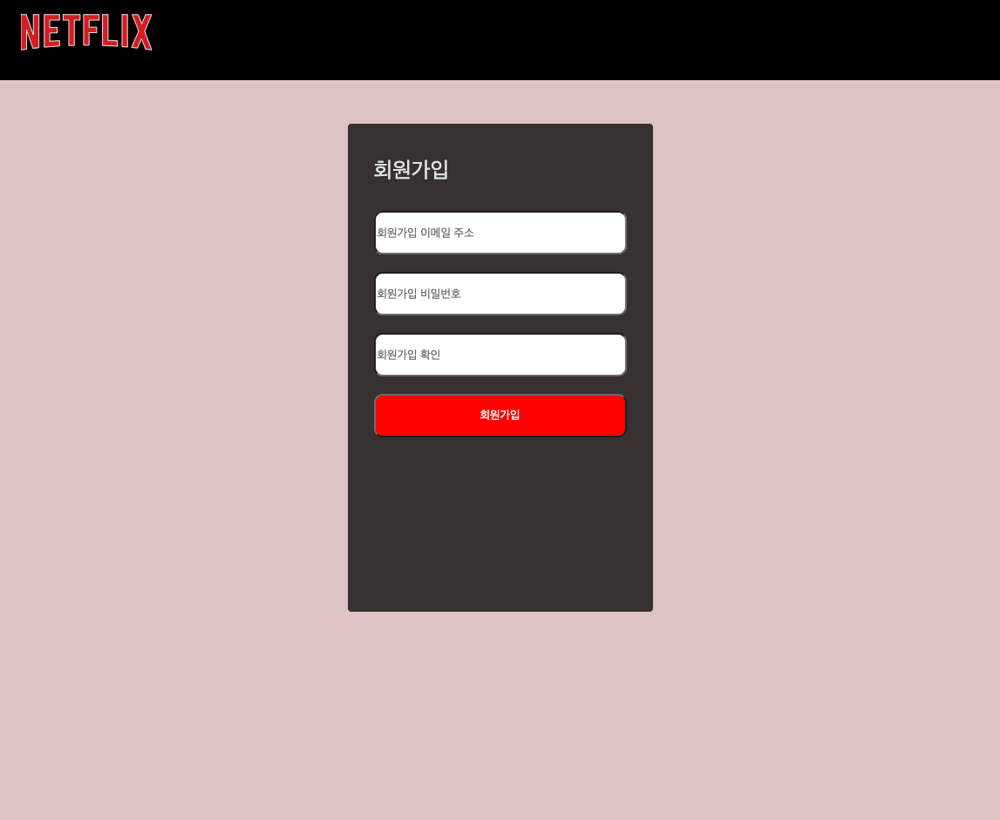
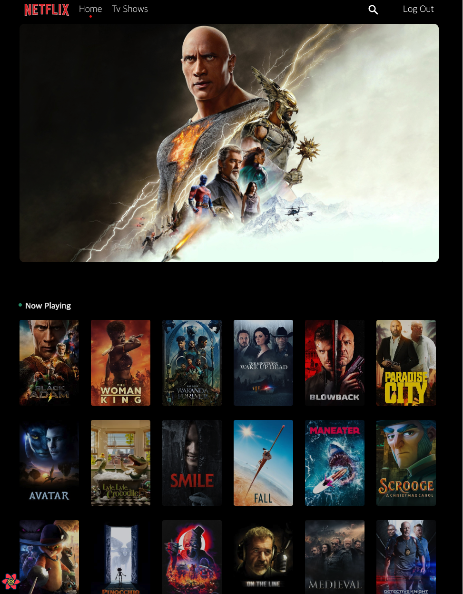
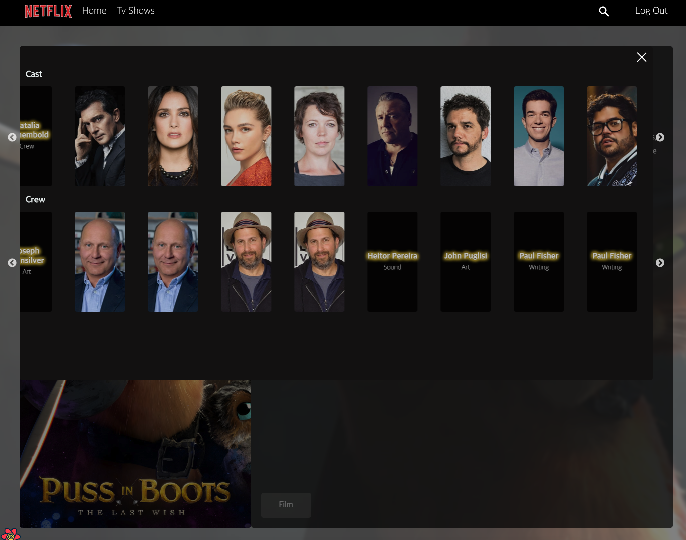
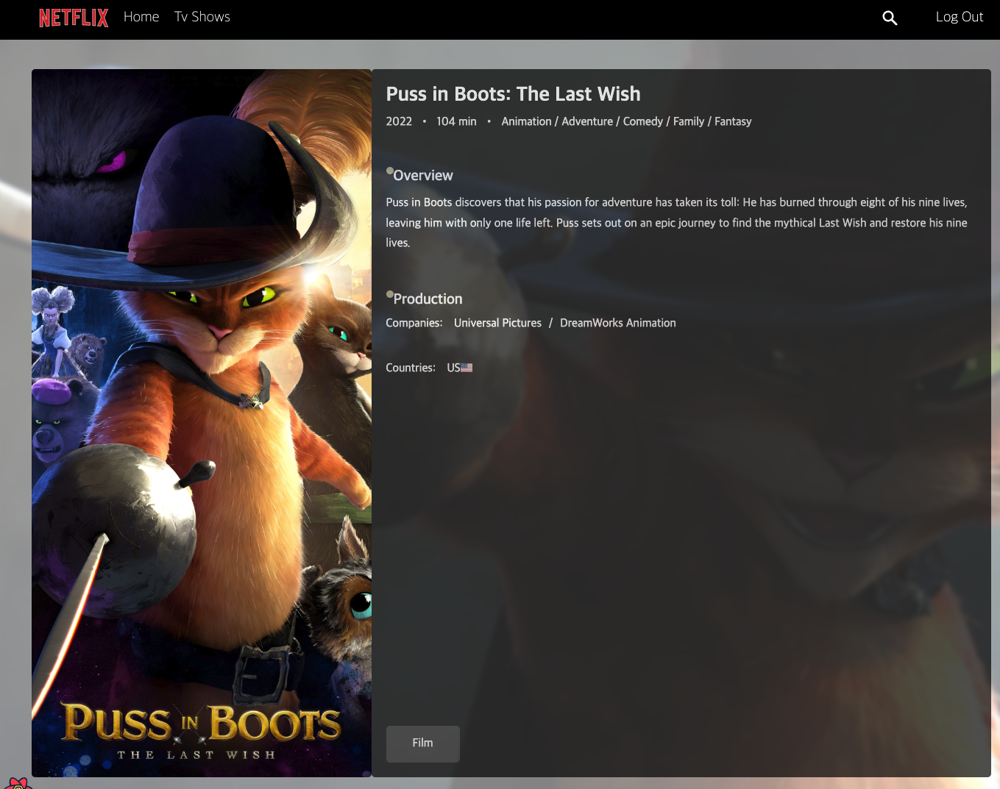
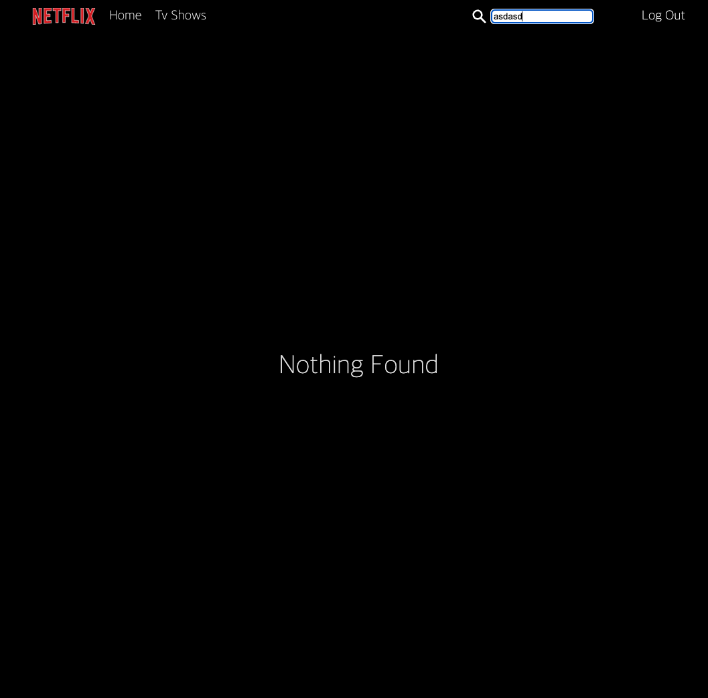

# React Project (react-masterclass)

Learning React and ES6 by building Movie App
<br>
<br>

# Visit Project
[Visit My Project](https://singyukang.github.io/react-masterclass/).
<br>
<br>

## Preview
<br>
<br>
<br>
<br>
<br>
<br>
<br>
<br>


## Tech Stack

| Frontend |      Technology       |      Description       |
| :------: | :-------------------: | :--------------------: |
|    01    |         React         |          CRA           |
|    02    |      React Hook       | Functional Programming |
|    02    |   Styled Components   |      Replace CSS       |
|    03    |     React Router      |    react-router-dom    |
|    04    | Container & Presenter |        Pattern         |
|    05    |         Axios         |        TMDB API        |

<br>
<br>

| Backend  |      Technology       |      Description       |
| :------: | :-------------------: | :--------------------: |
|    01    |       Firebase        |Login Auth verification | 


## Directory Structure

```
├── .DS_Store
├── App.tsx
├── Components
│   ├── CreditList.tsx
│   ├── Header.tsx
│   ├── Section.tsx
│   ├── SectionList.tsx
│   ├── loading
│   │   ├── Loading.tsx
│   │   └── LoadingImage.tsx
│   └── modal
│       └── Modal.tsx
├── GlobalStyle.tsx
├── Routes
│   ├── Home.tsx
│   ├── Login.tsx
│   ├── MovieDetail.tsx
│   ├── RequireAuth.tsx
│   ├── Search.tsx
│   ├── Signup.tsx
│   └── Tv.tsx
├── api
│   ├── customAxios.ts
│   └── services
│       └── MovieService.ts
├── api.ts
├── assets
│   ├── .DS_Store
│   ├── animations
│   │   ├── .DS_Store
│   │   ├── loading.json
│   │   ├── loading2.json
│   │   ├── loading3.json
│   │   ├── loading4.json
│   │   ├── loading5.json
│   │   └── loading6.json
│   ├── font
│   │   ├── .DS_Store
│   │   ├── Noto.css
│   │   └── Noto_Sans_KR
│   │       ├── NotoSansKR-Black.otf
│   │       ├── NotoSansKR-Bold.otf
│   │       ├── NotoSansKR-Light.otf
│   │       ├── NotoSansKR-Medium.otf
│   │       ├── NotoSansKR-Regular.otf
│   │       ├── NotoSansKR-Thin.otf
│   │       └── OFL.txt
│   └── images
│       ├── .DS_Store
│       ├── LoginImgage.jpeg
│       ├── close@2x.png
│       ├── close_wh.png
│       └── noImage.png
├── colors.ts
├── contexts
│   ├── AuthContext.tsx
│   ├── Auth_Context.tsx
│   └── LoadingContext.tsx
├── fBase.ts
├── index.tsx
├── react-app-env.d.ts
├── redux
│   ├── reducer.ts
│   ├── reducers
│   │   ├── addsub.ts
│   │   ├── counting.ts
│   │   └── loading.ts
│   └── store.ts
├── reportWebVitals.ts
├── setupTests.ts
├── styled.d.ts
├── theme.ts
├── themegloabalStyle.ts
└── utils.ts
```


## Screens

- Login
- SignUp
- Home
- TV
- Search
- Detail


## API

customAxios -> MovieService 


## Login 

createUserWithEmailAndPassword(auth, email, password)을 통해 유저를 생성하여 유저에게 메일을 보내 확인이 되면 회원가입이 됩니다.
로그인성공하면 localStorage에 uid를 넣습니다. uid가 없다면은 내부로 들어올수 없도록 AuthProvider 를 통해 로그인이 필요한 부분들을 감싸주었습니다.
아쉬운점은 JWT TOKEN을 활용하여 header에 넣고 유효성 검사를 하여 검증을 시도해 보고 싶었지만 영화제공API서버가 내것이 아니다 보니 헤더에 값을 넣고 쏠수가 없었습니다.token 값을  활용할 수 없었던 것이 아쉬웠습니다.


<br>


## Email Verification

sendEmailVerification(userCredential.user) 을 통해 이메일 verification 을 진행합니다
Email을 확인했는지 안했는지가 중요한 부분이었는데 auth.currentUser.emailVerified 를 통하여 이메일 검증 여부를 체크합니다.


<br>

## Managing State

상태관리 라이브러리로 Redux Mobx 등 다양한 라이브러리가 있지만 Context API 를 활용하여 상태관리를 진행하였습니다.
Redux와 상당히 유사한 구조로 dispatch 와 action.type을 통하여 상태를 관리합니다. Loading 하는 부분을 Context API로 구현하였습니다.
dispatch를 통하여 상태를 관리하기 때문에 어디서 문제가 생겼는지 빠르게 파악이 가능하다는 장점이있습니다.


<br>

## Home

map 함수를 통해 서버값을 여러개 뿌리는 작업을 통해 데이터구조와 많이 친숙해지는 계기가 되었습니다. Hover 기능을 이용하여 마우스를 올렸을때 animation효과를 넣었으며
지정된 위치에 도달했을때 카드들이 나오도록 하였습니다.


<br>

## Search

서버값에 값이 있을때 카드들에 값을넣어 반환하고 없을때는 Nothing Found 을 반환합니다

<br>

## Detail

Detail에서는 내가 어떤 영화 Tv 를 선택했는데 id가 중요했으며 서버값에 넣어 보내주어야 내가 원하는 영화나 Tv 정보를 서버로부터 받을수있습니다.
useLocation을 통해 id 값을 얻었으며 서버에 넘겨주었습니다. 서버에 받은 값을 통하여 페이지를 구성하였습니다.

<br>

## Animation

framer-motion 라이브러리 사용
initial animate exit 을 통하여 초기상태 마지막상태 내가원하는움직을 구현하여 사용자에게 다양한 애니메이션을 제공해줄수있습니다.


<br>

## Alert

sweetalert2 라이브러리 사용

<br>


